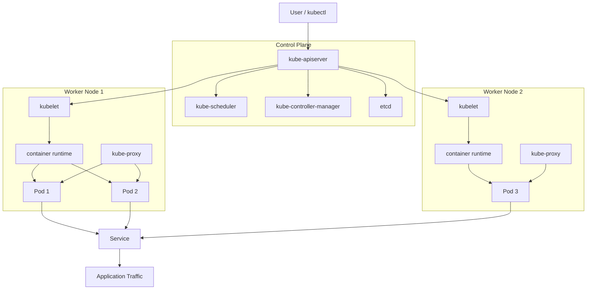

# Cluster Architecture, Installation, and Configuration

## 1. What is a Kubernetes cluster?

A Kubernetes cluster is a set of machines that run containerized applications and are managed by Kubernetes. It is made of:

- One or more control plane nodes
- One or more worker nodes
- A networking layer for communication between pods and nodes
- A storage layer for persistent data when needed
- A configuration and authentication model for users and services

The main idea is simple: Kubernetes schedules workloads, monitors health, restarts failed containers, and manages networking and scaling.

---

## 2. Cluster architecture

### Control plane

The control plane is the brain of the cluster. It decides where workloads should run, manages the cluster state, and exposes the Kubernetes API.

The main control plane components are:

#### kube-apiserver
- The front door to the cluster.
- All requests to Kubernetes go through the API server.
- It validates and processes requests from kubectl, controllers, and internal components.

#### etcd
- A distributed key-value store.
- Stores the cluster state and configuration.
- If etcd is lost or corrupted, the cluster becomes unstable.
- Production clusters usually run etcd in a highly available setup.

#### kube-scheduler
- Watches for newly created pods that do not have a node assigned.
- Chooses the best node based on resources, taints, tolerations, affinity, and policies.

#### kube-controller-manager
- Runs control loops for cluster reconciliation.
- Examples:
  - Node Controller
  - Replication Controller
  - Endpoint Controller
  - Job Controller

#### cloud-controller-manager
- Used when running on cloud providers.
- Manages load balancers, node provisioning, routes, and cloud-specific resources.

### Worker nodes

Worker nodes run the actual application workloads. Each node contains:

#### kubelet
- An agent that runs on every node.
- Ensures containers are running as expected.
- Communicates with the API server.

#### kube-proxy
- Manages network rules for Services.
- Helps route traffic to application pods.

#### Container runtime
- Runs the containers.
- Common options include:
  - containerd
  - CRI-O
  - Docker (older setups)

### Cluster schema



### Pod model

The smallest deployable unit in Kubernetes is the Pod. A Pod can contain one or more containers that share the same network namespace and storage.

Typical flow:

1. User creates a Deployment
2. The Deployment creates ReplicaSets
3. ReplicaSets create Pods
4. Scheduler picks a node for each Pod
5. kubelet starts containers on that node
6. kube-proxy exposes the application through Services

---

## 3. Core networking concepts

Kubernetes networking is one of the most important parts of a working cluster.

### Why networking matters

Containers on different nodes must be able to communicate with each other, and services must be reachable by users or other apps.

### Common networking pieces

#### Pod network
- Every pod gets its own IP address.
- Pods on different nodes should be able to communicate directly.

#### Service network
- Services provide a stable IP and DNS name for a group of pods.
- They abstract pod IP changes.

#### CNI plugins
- Container Network Interface (CNI) plugins implement pod networking.
- Popular examples:
  - Calico
  - Flannel
  - Weave

### Basic idea

A Service routes traffic to matching Pods using labels and selectors. This makes applications resilient even when Pods are restarted or rescheduled.

---

## 4. Installation prerequisites

Before installing a Kubernetes cluster, make sure the following are ready:

- A clean Linux machine or VM
- At least 2 CPUs and 2 GB RAM for a small lab setup
- Docker or containerd installed as the container runtime
- Correct hostname and DNS resolution
- Time synchronization between nodes
- Firewall and port rules opened for cluster communication
- Swap disabled on nodes

### Disable swap

Swap can interfere with Kubernetes scheduling and memory behavior.

```bash
sudo swapoff -a
sudo sed -i '/ swap / s/^(.*)$/#1/g' /etc/fstab
```

### Enable kernel modules

```bash
cat <<EOF | sudo tee /etc/modules-load.d/k8s.conf
overlay
br_netfilter
EOF

sudo modprobe overlay
sudo modprobe br_netfilter
```

### Configure sysctl

```bash
cat <<EOF | sudo tee /etc/sysctl.d/k8s.conf
net.bridge.bridge-nf-call-iptables = 1
net.bridge.bridge-nf-call-ip6tables = 1
net.ipv4.ip_forward = 1
EOF

sudo sysctl --system
```

---

## 5. Installing Kubernetes with kubeadm

kubeadm is the standard way to bootstrap a cluster on physical machines, VMs, or cloud instances.

### Step 1: Install container runtime

On Ubuntu/Debian, install `containerd`:

```bash
sudo apt-get update
sudo apt-get install -y ca-certificates curl gnupg
sudo install -m 0755 -d /etc/apt/keyrings
curl -fsSL https://download.docker.com/linux/ubuntu/gpg | sudo gpg --dearmor -o /etc/apt/keyrings/docker.gpg
sudo chmod a+r /etc/apt/keyrings/docker.gpg

echo \
  "deb [arch=$(dpkg --print-architecture) signed-by=/etc/apt/keyrings/docker.gpg] https://download.docker.com/linux/ubuntu \
  $(. /etc/os-release && echo "$VERSION_CODENAME") stable" | \
  sudo tee /etc/apt/sources.list.d/docker.list > /dev/null

sudo apt-get update
sudo apt-get install -y containerd.io
```

Then configure containerd:

```bash
sudo mkdir -p /etc/containerd
containerd config default | sudo tee /etc/containerd/config.toml
sudo systemctl restart containerd
sudo systemctl enable containerd
```

### Step 2: Install Kubernetes packages

```bash
curl -fsSL https://pkgs.k8s.io/core:/stable:/v1.30/deb/Release.key | sudo gpg --dearmor -o /etc/apt/keyrings/kubernetes-apt-keyring.gpg

echo 'deb [signed-by=/etc/apt/keyrings/kubernetes-apt-keyring.gpg] https://pkgs.k8s.io/core:/stable:/v1.30/deb/ /' | sudo tee /etc/apt/sources.list.d/kubernetes.list

sudo apt-get update
sudo apt-get install -y kubelet kubeadm kubectl
sudo apt-mark hold kubelet kubeadm kubectl
```

### Step 3: Initialize the control plane

On the first master node:

```bash
sudo kubeadm init --pod-network-cidr=10.244.0.0/16
```

This command creates the control plane and prints the join command for worker nodes.

Example output:

```bash
kubeadm join 10.0.0.2:6443 --token abcdef.1234567890abcdef \
    --discovery-token-ca-cert-hash sha256:xxxxxxxxxxxxxxxxxxxxxxxxxxxxxxxxxxxxxxxxxxxxxxxxxxxxxxxx
```

### Step 4: Configure kubectl for the user

```bash
mkdir -p $HOME/.kube
sudo cp -i /etc/kubernetes/admin.conf $HOME/.kube/config
sudo chown $(id -u):$(id -g) $HOME/.kube/config
```

### Step 5: Install a CNI plugin

Kubernetes needs a network plugin for pod-to-pod communication. A common option is Flannel.

```bash
kubectl apply -f https://raw.githubusercontent.com/flannel-io/flannel/master/Documentation/kube-flannel.yml
```

### Step 6: Join worker nodes

On each worker node, run the join command generated by kubeadm init.

```bash
sudo kubeadm join 10.0.0.2:6443 --token abcdef.1234567890abcdef \
    --discovery-token-ca-cert-hash sha256:xxxxxxxxxxxxxxxxxxxxxxxxxxxxxxxxxxxxxxxxxxxxxxxxxxxxxxxx
```

---

## 6. Verify the cluster

After installation, verify that the cluster is healthy.

```bash
kubectl get nodes
kubectl get pods -A
kubectl cluster-info
```

You should see:

- All nodes in Ready state
- Core system pods in the kube-system namespace
- The API server and scheduler responding

### Example output

```bash
NAME       STATUS   ROLES           AGE   VERSION
master-1   Ready    control-plane  5m    v1.30.0
worker-1   Ready    <none>          3m    v1.30.0
```

---

## 7. Kubernetes configuration basics

### kubeconfig

The kubeconfig file stores cluster connection details, such as:

- cluster name
- server endpoint
- certificate authority
- user credentials

Typical file:

```bash
~/.kube/config
```

You can inspect it with:

```bash
kubectl config view
kubectl config get-contexts
```

### Contexts

A context binds together:

- a cluster
- a user
- a namespace

Example:

```bash
kubectl config use-context kubernetes-admin@kubernetes
```

### Namespaces

Namespaces allow you to isolate resources logically.

```bash
kubectl get namespaces
kubectl create namespace dev
kubectl get pods -n kube-system
```

Common namespaces:

- default
- kube-system
- kube-public
- kube-node-lease

---

## 8. High availability and production design

For production clusters, a single control plane node is not enough.

### Recommended control plane model

- 3 control plane nodes for HA
- 3 or more worker nodes for workload distribution
- Load balancer in front of the API servers
- Dedicated networking and storage solutions
- Centralized monitoring and logging

### Why HA matters

If one control plane node fails, the cluster should continue functioning. This avoids downtime and reduces the risk of losing control of the cluster.

---

## 9. Roles and responsibilities

### Control plane responsibilities
- Manage the cluster state
- Run scheduler and controllers
- Serve the API
- Store cluster data in etcd

### Worker responsibilities
- Run containers
- Report node health
- Execute kubelet actions
- Maintain network access through kube-proxy

---

## 10. Common installation and configuration issues

### Node is NotReady

Possible causes:

- kubelet is not running
- Container runtime not working properly
- Network plugin not installed
- DNS or firewall issues

Check:

```bash
sudo systemctl status kubelet
sudo journalctl -u kubelet -n 100 --no-pager
```

### Pods stuck in Pending

Possible causes:

- No available node resources
- Scheduler cannot find a place to run the pod
- Network plugin not ready
- Incorrect taints or tolerations

Check:

```bash
kubectl get pods -A
kubectl describe pod <pod-name> -n <namespace>
```

### coredns not running

This often means the cluster network is not ready.

```bash
kubectl get pods -A | grep coredns
kubectl logs -n kube-system deploy/coredns
```

### kubeadm errors during init

Typical causes:

- Swap still enabled
- Missing kernel params
- Container runtime not configured correctly
- Invalid hostname or DNS configuration

---

## 11. Lab exercise

### Exercise 1: Create and inspect a cluster

```bash
kubectl get nodes
kubectl get pods -A
kubectl get namespaces
```

### Exercise 2: Deploy an Nginx app

```bash
kubectl create deployment nginx --image=nginx
kubectl get pods
kubectl expose deployment nginx --port=80 --type=NodePort
kubectl get svc
```

### Exercise 3: Inspect the workload

```bash
kubectl get deploy,rs,po
kubectl describe pod <pod-name>
kubectl logs <pod-name>
```

### Exercise 4: Scale the app

```bash
kubectl scale deployment nginx --replicas=3
kubectl get pods -w
```

---

## 12. Quick revision notes

- Kubernetes has a control plane and worker nodes.
- The control plane manages the cluster state and API.
- Worker nodes run application containers.
- kubelet and kube-proxy are required on every node.
- kubeadm is a common way to bootstrap a cluster.
- etcd stores cluster data and must be protected.
- Networking is required before workloads can communicate.
- kubeconfig is used to connect to the cluster.
- Namespaces are used for logical isolation.
- High availability is important in production.

---

## 13. Key commands 

```bash
kubectl get nodes
kubectl get pods -A
kubectl get svc
kubectl describe pod <pod-name>
kubectl logs <pod-name>
kubectl create deployment nginx --image=nginx
kubectl scale deployment nginx --replicas=3
kubectl config view
kubectl get namespaces
```

---


